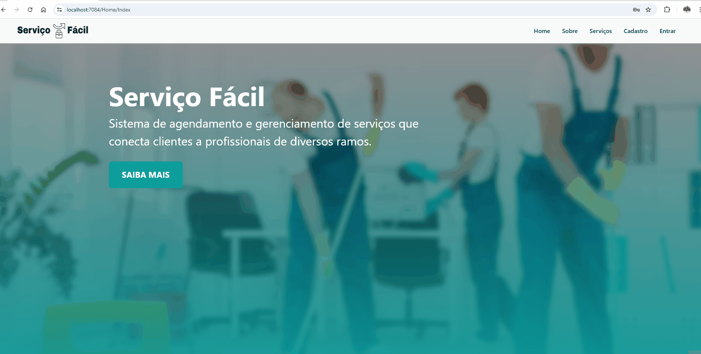
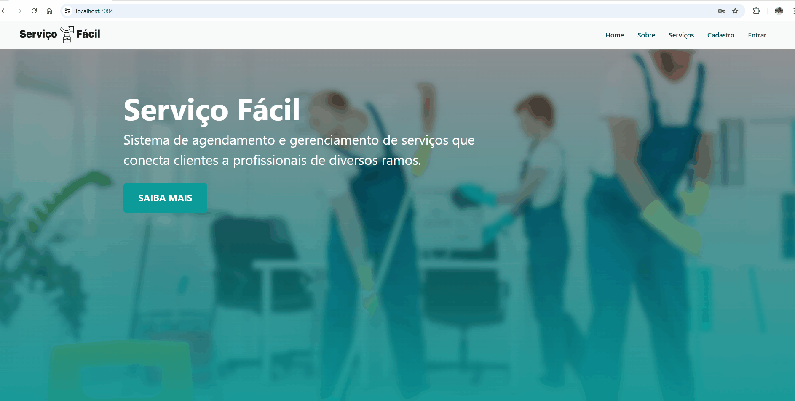
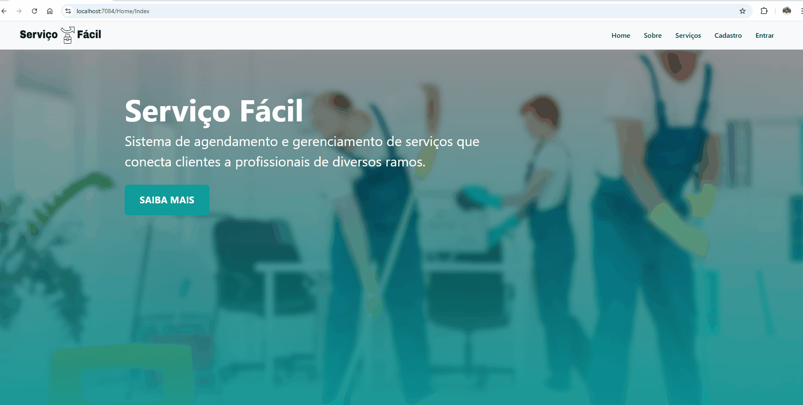
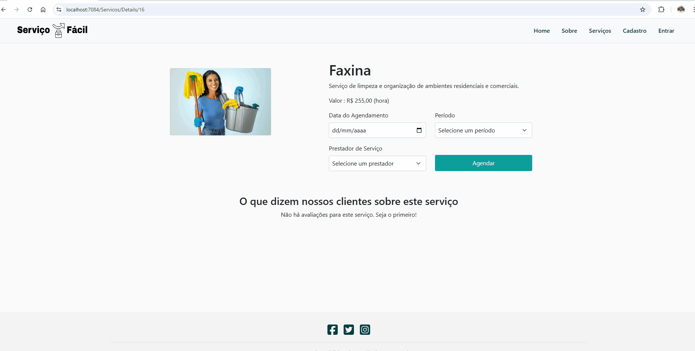

# Registro de Testes de Software

| Caso de Teste      | CT-01 - Verificar o cadastro de usuários (Cliente ou Prestador)                                                                                |
|--------------------------------------------|--------------------------------------------------------------------------------------------------------------------------------------------------------------------------------------------------|
| Requisitos Associados  |  RF-01: A aplicação deve permitir que o usuário cadastre uma conta como cliente ou prestador de serviço.                                    |
| Objetivo do Teste      | Verificar se o cadastro está sendo feito corretamente.            |
| Passos                 | 1. Navegar para a página de cadastro. 2. Selecionar o tipo de conta (cliente/prestador). 3. Preencher os campos obrigatórios. 4. Submeter o formulário.   |
| Critérios de Êxito     | O usuário deve ser cadastrado com sucesso e uma mensagem de confirmação deve ser exibida.  |
| Resultado Obtido   |   Sucesso. O sistema exibiu a mensagem de confirmação conforme esperado.         | 
| Responsável pela execução do caso de Teste   |   Laura Furtado Amaral   |         

## Registro de Cadastro com Sucesso - Cliente

![Teste 1 Sucesso]

## Registro de Cadastro com Sucesso - Prestador

![Teste 1 Sucesso]

| Caso de Teste      | CT-02: Verificar o login de usuários                                                                                 |
|--------------------------------------------|--------------------------------------------------------------------------------------------------------------------------------------------------------------------------------------------------|
| Requisitos Associados  |  RF-02: A aplicação deve permitir que o usuário faça login na sua conta.                                    |
| Objetivo do Teste      | Verificar se o login está sendo feito corretamente.            |
| Passos                 | 1. Acessar a página Entrar. 2. Inserir e-mail e senha corretos. 3. Clicar em "Entrar".   |
| Critérios de Êxito     | O sistema deve permitir o login e redirecionar para o pagina Home.  | 
| Resultado Obtido   |   O usuário foi autenticado e redirecionado corretamente para a página "Home".         |
| Responsável pela execução do caso de Teste   |   Gabriel Roeder   |         

## Login do usuário com sucesso - Cliente

![Teste 2 Sucesso]

## Login do usuário com sucesso - Prestador

![Teste 2 Sucesso]

## Login do usuário sem sucesso - dados incorretos

![Teste 2 Sem Sucesso]

| Caso de Teste      | CT-03: Busca e Visualização de Prestadores de Serviço                                                                                |
|--------------------------------------------|--------------------------------------------------------------------------------------------------------------------------------------------------------------------------------------------------|
| Requisitos Associados  |  RF-03: A aplicação deve permitir que o cliente busque e visualize prestadores de serviços disponíveis.                                    |
| Objetivo do Teste      | Testar a busca por prestadores de serviços e exibição dos resultados.            |
| Passos                 | 1. Acessar a tela de busca de prestadores. 2. Buscar prestador . 3. Submeter e visualizar resultados.   |
| Critérios de Êxito     | O sistema deve exibir prestadores que correspondem aos critérios.  | 
| Resultado Obtido   |   A lista de prestadores foi exibida corretamente com base nos filtros aplicados.         |         
| Responsável pela execução do caso de Teste   |   Thiago Emanuel da Costa   |

## Busca e Visualização de Prestadores de Serviço 

![Teste 3 Sucesso]

| Caso de Teste      | CT-04: : Agendamento de Serviços                  |
|--------------------------------------------|------------------------------------------------------------------------------------------------------------------------------------------------------------------------------------------------|
| Requisitos Associados  | RF-04: A aplicação deve permitir que o cliente agende serviços com os prestadores selecionados.  |
| Objetivo do Teste      | Testar a funcionalidade de agendamento de serviços.                                                               |
| Passos                 | 1. Selecionar um prestador de serviços. 2.Escolher uma data e hora disponíveis. 3. Confirmar o agendamento.                                              |
| Critérios de Êxito     |   O agendamento deve ser registrado e confirmado com sucesso. | 
| Resultado Obtido   |   O agendamento foi concluído e o usuário recebeu a confirmação e os detalhes do serviço agendado.         |         
| Responsável pela execução do caso de Teste   |   Ytallo Bruno Canuto Guedes   |

## Agendamento de Serviços 

| Caso de Teste      | CT-05: Visualização do Status de Serviço Agendado                 |
|--------------------------------------------|------------------------------------------------------------------------------------------------------------------------------------------------------------------------------------------------|
| Requisitos Associados  | RF-06: A aplicação deve permitir que o cliente visualize o status de um serviço agendado.  |
| Objetivo do Teste      | Testar a funcionalidade de visualização de status de serviço.                                                               |
| Passos                 | 1. Após o agendamento, acessar o painel de status de serviços. 2. Verificar o status do serviço (pendente, em andamento, concluído).                           |
| Critérios de Êxito     |   O status do serviço deve ser atualizado corretamente conforme a progressão.  | 
| Resultado Obtido   |   O painel foi exibido corretamente e mostrou o status dos serviços agendados.         |         
| Responsável pela execução do caso de Teste   |   Sidney Gabriel Abreu Magalhães   |                                                      |                                      
              
## Visualização do Status de Serviço Agendado 

![Teste 4 Sucesso]

